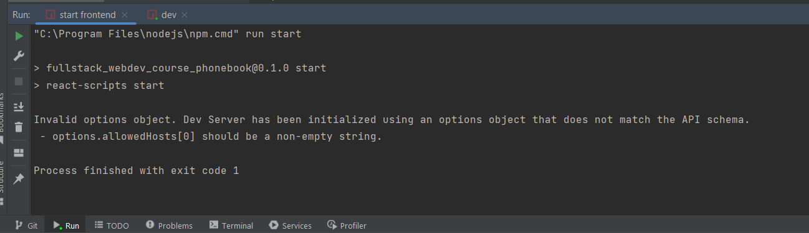

# fullstack_webdev_course_phonebook_backend
exercise from part 3 of fullstack webdev course of Helsinki openuniversity.
## Exercise 3.10
Deploying backend on cloud service.
Url to the app : https://small-thunder-7000.fly.dev/api/persons
## Exercise 3.11
This exercise is not working on my machine, probably due to some version problem in some packages.
The project has been cloned in Linux and Windows and is working on both operating systems: with a clean installation of NodeJS there is no problem.

Error:

I've tried different ways to solve it (install uninstall node_modules, specify allowedHost and so on).
After 2 days I gave up, maybe I'll try later: for now I'm running the frontend with
`DANGEROUSLY_DISABLE_HOST_CHECK=true pnpm start`.

